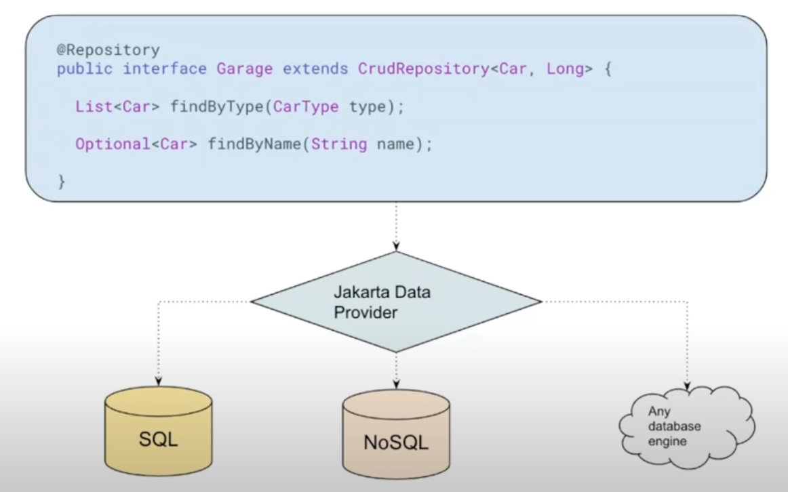

Jakarta Data demo
===================

The Jakarta Data specification provides an API to simplify data access.
It enables the Java developer to focus on the data model, while delegating away the complexities of data persistence.
To make this possible, Jakarta Data includes a variety of features such as pre-built interfaces for data access, offset and cursor based pagination strategies,
and the ability to compose custom query methods that the framework implements.

# Vocabulary

* Repository: repository pattern encapsulates the logic required to access data sources
* Entity Classes: a simple Java object equipped with fields or accessor methods designating each property of the entity
* Repository Interfaces: a Java interface annotated with `@Repository`.
* Jakarta Data Query Language
* Jakarta Data Providers

# Repository

Repository inheritance: `DataRepository -> BasicRepository -> CrudRepository -> XxxRepository`.

Annotations:

* `@Insert`
* `@Update`
* `@Delete`
* `@Save`
* `@Find`
* `@Query`:  `@Query("FROM Order WHERE address.zipCode = ?1")`
* `@By` or `@OrderBy`

# Entity

Every entity programming model specifies an entity-defining annotation.
For Jakarta Persistence, this is `jakarta.persistence.Entity`. For Jakarta NoSQL, it is `jakarta.nosql.Entity`.

Basic Types:

* Primitive types and wrapper classes
* `String`
* `LocalDate`, `LocalDateTime`, `LocalTime`, `Instant` from `java.time`
* `java.util.UUID`
* `BigInteger` and `BigDecimal` from `java.math`
* `byte[]`
* User-defined enum types

# References

* Jakarta Data: https://github.com/jakartaee/data
* Jakarta Data Specification: https://jakarta.ee/specifications/data/1.0/data-1.0.0-m4
* Jakarta Data Javadoc: https://jakarta.ee/specifications/data/1.0/apidocs
* Jakarta Persistence 3.2: https://jakarta.ee/specifications/persistence/3.2/
* A summary of Jakarta Persistence 3.2: https://in.relation.to/2024/04/01/jakarta-persistence-3/
* A preview of Jakarta Data 1.0 (Part I): https://in.relation.to/2024/04/01/jakarta-data-1/
* A preview of Jakarta Data 1.0 (Part II): https://in.relation.to/2024/04/18/jakarta-data-1/
* Unlocking Data Access Excellence with Jakarta Data: https://www.youtube.com/watch?v=LbmXvd-4p3U
